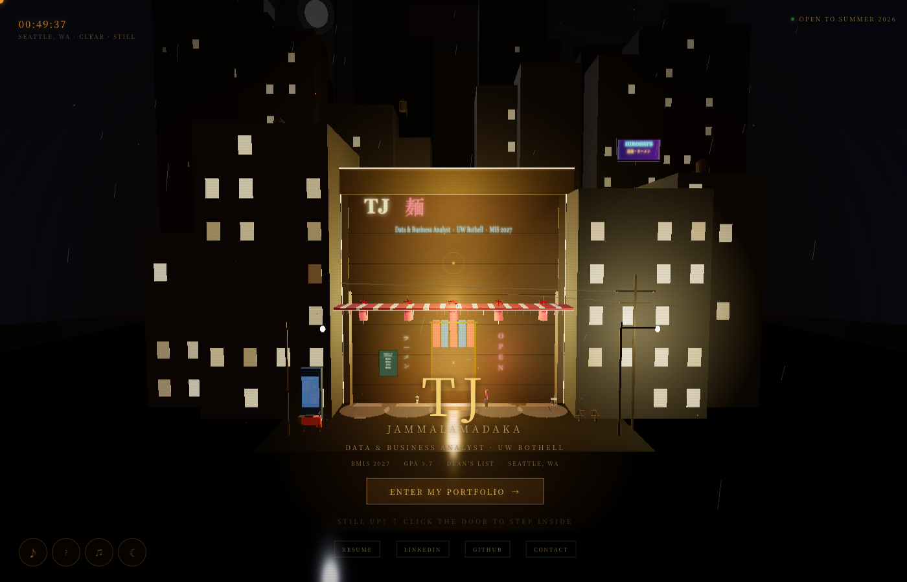

# 3D Ramen Shop Portfolio

> Step into a hand-built 3D ramen shop. Sit at the bar. Browse my work.

**Live site:** [tarang-tj.github.io/3d-ramenshop-portfolio](https://tarang-tj.github.io/3d-ramenshop-portfolio/)



An interactive portfolio built as a single HTML file. No frameworks, no build tools, no package manager, just Three.js r128, vanilla JavaScript, and every mesh written by hand.

## What's in the scene

- Real-time 3D ramen shop with PBR-style materials, hemisphere + point lighting, and a gradient night-sky dome (navy horizon glow fading to near-black zenith)
- UnrealBloom post-processing so the neon, lanterns, and shop windows actually glow. Runs at half resolution and falls back to a plain render if the effect CDN is blocked
- Rain system with wind modulation and a CRT scanline overlay
- Particle steam rising from the bowls
- Six lantern glows + a flickering red neon sign
- Wet asphalt: a low-roughness, high-metalness street plane throws specular highlights from every neon and lantern, and glow pools sit under the lantern line. Bloom makes those highlights bleed like a rained-on road
- Roughly 380 stars in three brightness tiers, plus a moon and drifting clouds
- Interactive zones: sit at any of six stools, inspect three different bowls, open four portfolio panels
- Periodic lightning storm (every 18 to 35s, three-pulse flash with scene illumination boost)
- Day/night toggle (`N`) that swaps the sky dome, hides the stars and moon, warms the fog, and softens the bloom
- Camera parallax that drifts the scene toward your mouse
- Japanese omikuji fortunes (press `F` for a random blessing)
- Konami code easter egg — rainbow neon mode for 15 seconds + ramen emoji rain
- Time-aware greeting that changes based on your local hour (late-night ramen at 1am hits different from the afternoon lull)

## Controls

| Key | Action |
|---|---|
| `E` / `Enter` | Enter the shop (from outside) |
| `H` | Step back outside |
| `1` – `4` | Open Projects / Experience / Skills / Contact panels |
| `M` | Open the menu card |
| `S` | Toggle ambient sound |
| `L` | Toggle lo-fi music |
| `N` | Toggle day/night |
| `F` | Pull an omikuji fortune |
| `?` | Keyboard shortcuts overlay |
| `Esc` | Close overlay / stand up / return |
| Drag | Look around |
| Scroll wheel | Zoom |

The classic Konami sequence (↑ ↑ ↓ ↓ ← → ← → B A) unlocks rainbow neon mode for 15 seconds.

## Technical notes

- **Single file, zero build**: `index.html` loads Three.js r128 plus the r128 UnrealBloom example scripts from a CDN and a Google Fonts stylesheet, then everything else is inline CSS + JS
- **Bloom pipeline with fallback**: an `EffectComposer` runs a `RenderPass` then a half-resolution `UnrealBloomPass` (strength 0.55, radius 0.4, threshold 0.82) so only bright emissives glow. A `canPost` guard checks the effect globals loaded; if the CDN is blocked it renders straight through `renderer.render()` with no glow and no errors. The composer is rebuilt on resize and after context restore
- **Device-adaptive pixel ratio**: caps at 2x on desktop, 1.5x on mobile or low-core (four threads or fewer) devices, clamped to the real device DPR. Each WebGL context loss steps one rung down a degradation ladder so a stressed GPU trades resolution for stability instead of going blank
- **WebGL context loss recovery**: `webglcontextlost` / `webglcontextrestored` handlers reapply renderer state, rebuild the bloom composer, and shed GPU pressure if the driver resets
- **Graceful fallback**: if `WebGLRenderer` construction fails entirely (disabled hardware acceleration, corporate-locked laptop, context exhaustion), the page swaps in a clean text-only portfolio so visitors can always reach the resume + links
- **Animation throttling**: non-critical particle and light updates skip every other frame. Heavy work pauses when a panel is open (render every 8th frame for background visibility). The whole animation loop fully pauses when the tab is hidden (`visibilitychange`)
- **Resize debouncing**: 120ms debounce on window resize to avoid layout thrash during drag-resize, re-sizing the renderer and the bloom composer together
- **Reduced-motion support**: `prefers-reduced-motion: reduce` disables film grain, vignette breathing, lightning flashes, and the fortune card's slide-in. Bloom stays on but never pulses

## Projects showcased

1. **[ragproof](https://github.com/tarang-tj/ragproof)**: open-source RAG evaluation harness built from scratch. Scores retrieval and generation with hit@k, MRR, NDCG, recall, answer faithfulness, per-query cost, and embedding-drift detection. BEIR-benchmarked (dense bge-small hits NDCG@10 0.720 vs 0.56 for BM25). 54 tests + CI. Python, CLI, Docker
2. **[SyllabusAI](https://syllabusai.net)**: upload a syllabus, get every deadline in your calendar in seconds. 500+ active users, 2,500+ syllabi processed at 95%+ accuracy. Claude API, Node.js, Supabase, Vercel, real-time SSE, Google Calendar OAuth, PWA
3. **[AutoAppli](https://autoappli.com)**: AI job-application platform. Resume tailoring, outreach drafts, and Kanban tracking. Next.js, TypeScript, FastAPI, Supabase, Claude API
4. **Jacobs' Pharmacy 3D Recreation**: procedural recreation of the 1886 pharmacy where Coca-Cola was first served, with Blender driven through Python so the space is generated from code. Ongoing Coca-Cola internship capstone, full build under wraps
5. **Economic Pulse Dashboard**: Python + Streamlit pulling live FRED data with regression trend detection
6. **E-Commerce SQL Analytics**: PostgreSQL, 6-table schema, cohort and window-function analysis
7. **WA Rising Rent & Homelessness**: 9 years of Zillow data, R + Tableau
8. **This portfolio**: the thing you're reading about right now

## About me

**Tarang (TJ) Jammalamadaka** · Applied AI & Full-Stack Engineer

- University of Washington Bothell · MIS · Class of 2027 · GPA 3.7 · Dean's List
- Currently: Global Human Insights Intern @ The Coca-Cola Company (Ignite Program, Atlanta)
- Open to Applied-AI and forward-deployed engineering roles starting June 2027

[Resume (PDF)](TJ_Resume.pdf) · [LinkedIn](https://linkedin.com/in/tarang-tj) · [GitHub](https://github.com/tarang-tj) · tarangjammalamadaka9@gmail.com

## Running locally

Clone and open — there's nothing to install:

```
git clone https://github.com/tarang-tj/3d-ramenshop-portfolio.git
cd 3d-ramenshop-portfolio
open index.html
```

Or just double-click `index.html` in Finder. Works in any modern browser with WebGL enabled.

## License

Source is open for learning and inspiration. If you remix or reuse meaningful pieces, a credit link back would be appreciated.
