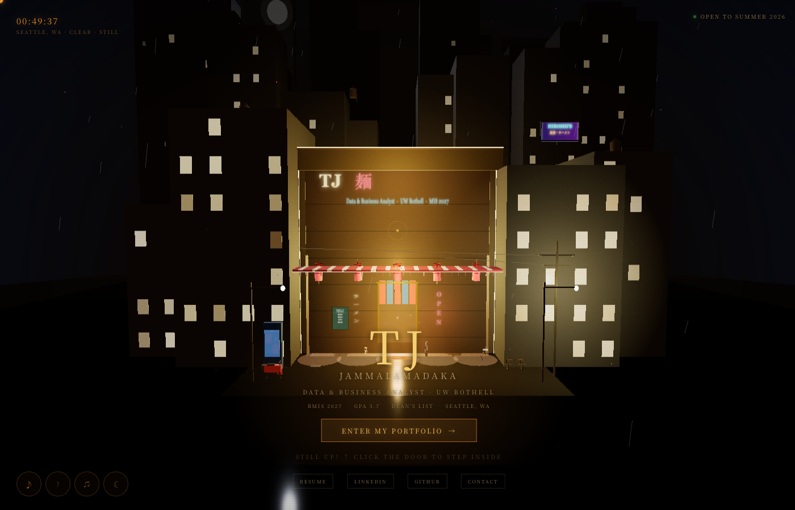

# 3D Ramen Shop Portfolio

> Step into a hand-built 3D ramen shop. Sit at the bar. Browse my work.

**Live site:** [tarang-tj.github.io/3d-ramenshop-portfolio](https://tarang-tj.github.io/3d-ramenshop-portfolio/)



An interactive portfolio written by hand: one HTML file, four stylesheets in `css/`, and a set of ordered classic scripts in `js/`. No build step, no frameworks, no package to install for visitors. The only devDependency is Playwright, and it exists for the verification gate.

## What's in the scene

### Night Shift interface

- An editorial "night shift" layer turns the exterior into a guided entry point with a live environmental signal, a short portfolio thesis, and fast paths to work, story, craft, or contact.
- Inside, navigation becomes a compact floating counter, and a contextual desk introduces the next interaction without covering the 3D world.
- The free-explore shop is unchanged. The added layer gives recruiters and collaborators a clearer path through it.

### The shop

- Real-time 3D ramen shop with PBR-style materials, hemisphere and point lighting, and a gradient night-sky dome (navy horizon glow fading to near-black zenith)
- UnrealBloom post-processing so the neon, lanterns, and shop windows actually glow. It runs at half resolution and falls back to a plain render if the effect CDN is blocked
- Rain system with wind modulation and a CRT scanline overlay
- Particle steam rising from the bowls
- Six lantern glows and a flickering red neon sign
- Wet asphalt: a low-roughness, high-metalness street plane throws specular highlights from every neon and lantern, and glow pools sit under the lantern line. Bloom makes those highlights bleed like a rained-on road
- Roughly 380 stars in three brightness tiers, plus a moon and drifting clouds
- Interactive zones: sit at any of six stools, inspect three different bowls, open four portfolio panels
- A stamp rally you can fill by finding the shop's landmarks, and a Noodle Catch arcade cabinet you can actually play
- Periodic lightning storm (every 18 to 35s, a three-pulse flash with a scene illumination boost)
- Day/night toggle (`N`) that swaps the sky dome, hides the stars and moon, warms the fog, and softens the bloom
- Camera parallax that drifts the scene toward your mouse
- Japanese omikuji fortunes (press `F` for a random blessing)
- Konami code easter egg: rainbow neon mode for 15 seconds, plus ramen emoji rain
- Time-aware greeting that changes with your local hour

## Controls

| Key | Action |
|---|---|
| `E` / `Enter` | Enter the shop (from outside) |
| `H` | Step back outside |
| `1` - `4` | Open Projects / Experience / Skills / Contact panels |
| `M` | Open the menu card |
| `G` | Open the stamp card |
| `P` | Play the Noodle Catch arcade cabinet |
| `V` | Drone mode (unlocks after the stamp rally is finished) |
| `S` | Toggle ambient sound |
| `L` | Toggle lo-fi music |
| `N` | Toggle day/night |
| `F` | Pull an omikuji fortune |
| `?` | Keyboard shortcuts overlay |
| `Esc` | Close overlay / stand up / return |
| Drag | Look around |
| Scroll wheel | Zoom |

The classic Konami sequence (up up down down left right left right B A) unlocks rainbow neon mode for 15 seconds.

## Technical notes

- **Ordered classic scripts, zero build**: `index.html` loads Three.js r128 and the r128 UnrealBloom example scripts from a CDN, a Google Fonts stylesheet, the four files in `css/`, and then every file in `js/` in numeric order. They share one global scope on purpose, so the browser is the only tool in the chain. Visitor-facing copy lives in `js/70-content.js`, `js/71-content-projects.js`, and `js/72-content-experience.js`
- **Bloom pipeline with fallback**: an `EffectComposer` runs a `RenderPass` then a half-resolution `UnrealBloomPass` (strength 0.55, radius 0.4, threshold 0.82) so only bright emissives glow. A `canPost` guard checks that the effect globals loaded. If the CDN is blocked it renders straight through `renderer.render()` with no glow and no errors. The composer is rebuilt on resize and after context restore
- **Device-adaptive pixel ratio**: caps at 2x on desktop and 1.5x on mobile or low-core (four threads or fewer) devices, clamped to the real device DPR. Each graphics context loss steps one rung down a degradation ladder, so a stressed GPU trades resolution for stability instead of going blank
- **Context-loss recovery**: `webglcontextlost` and `webglcontextrestored` handlers reapply renderer state, rebuild the bloom composer, and shed GPU pressure if the driver resets
- **Graceful fallback**: if renderer construction fails entirely (disabled hardware acceleration, a locked-down laptop, context exhaustion), the page swaps in a clean text-only portfolio so visitors can always reach the resume and links
- **Animation throttling**: non-critical particle and light updates skip every other frame. Heavy work pauses when a panel is open (one render every eighth frame, for background visibility). The whole loop pauses when the tab is hidden (`visibilitychange`)
- **Resize debouncing**: a 120ms debounce on window resize avoids layout thrash during a drag-resize, and resizes the renderer and the bloom composer together
- **Reduced-motion support**: `prefers-reduced-motion: reduce` disables film grain, vignette breathing, lightning flashes, and the fortune card's slide-in. Bloom stays on but never pulses

## Verification gate

Install the dev dependency once, then run the gate:

```
npm run gate
```

It runs three checks in order:

1. `check:syntax` parses every file in `js/` and every inline script in `index.html`
2. `check:claims` scans the visitor-facing text against the claims ledger, bans phrases that could not be defended, and enforces the canonical GPA
3. `verify:boot` serves the repo, opens it in headless Chrome, and asserts zero console errors, a non-blank drawing buffer, and a working panel flow. Screenshots land in `artifacts/`

## Projects showcased

1. **[ragproof](https://github.com/tarang-tj/ragproof)**: open-source RAG evaluation harness. BM25, dense, and hybrid retrieval, with a Hugging Face embedding model and a cross-encoder reranker. On BEIR scifact, dense bge-small scores NDCG@10 0.720 against 0.560 for BM25. 54 tests, Docker, green CI
2. **[SyllabusAI](https://syllabusai.net)**: upload a syllabus, get every deadline in your calendar. Parser wedge exporting to Google, Apple, Outlook, and .ics, plus an AI study companion on Claude across six surfaces, and per-user cost ceilings. Free to use. React, Express, Supabase, 1,055 tests
3. **[AutoAppli](https://autoappli.com)**: AI job-application platform. Kanban with pipeline-health widgets, a match scorer that explains itself per dimension, 11 ATS sources, 357 live-validated boards, and a Chrome extension over five of them. Next.js, FastAPI, Supabase, Claude API
4. **Pokemon TCG AI Battle Challenge**: 245 of 6,807 final, top 3.60%. A gradient-boosted policy trained by imitation learning and self-play, with four changes rejected as measured nulls and an 11-point gain traced to an evaluation artifact
5. **Message Notification Router**: 14th of 1,983 in the HackerRank Orchestrate hackathon. 110 multimodal messages, eval harness written first, 30 of 30 on action labels, 110-row adversarial audit
6. **[Model Sentinel](https://github.com/tarang-tj/model-sentinel)**: production ML guardian over DataHub lineage. Deterministic detectors write findings back as lineage tags. In-memory fixture and live-graph adapters, gated by ruff, pytest, and a CI demo scan. Apache-2.0
7. **[Economic Pulse Dashboard](https://github.com/tarang-tj/economic-pulse-dashboard)**: Python and Streamlit over seven live FRED indicators, with rolling-window regression trend detection and NBER recession shading
8. **This portfolio**: the thing you are reading about right now

Extra courses: **[ShelterBrief](https://github.com/tarang-tj/civic-gemma)** (Gemma 4 tool-calling agent over public HUD data), **[Starship Flow Control](https://github.com/tarang-tj/starship-flow-control)** (three-level BOM constraint radar, 20 tests), **[claude-skill-audit](https://github.com/tarang-tj/claude-skill-audit)** (zero-dependency TypeScript scanner for prompt-injection, supply-chain, and secret-exposure risk), **[E-commerce revenue analysis](https://github.com/tarang-tj/ecommerce-sql)** (620 orders, $112K, 18 months), **[Washington housing affordability study](https://github.com/tarang-tj/wa-housing-homelessness)** (nine years of rent and homelessness data, R and Tableau), **Reach** (real-time Battlesnake move server inside a 500 ms budget, CoG 2026), and **Jacobs' Pharmacy** (procedural Blender scene of the 1886 corner, driven through Python).

## About me

**Tarang (TJ) Jammalamadaka**, applied AI and full-stack engineer.

- University of Washington Bothell, B.A. Business Administration (Management Information Systems), minors in Data Analytics and Economics, expected June 2027, Dean's List 2024, 2025 and 2026
- Completed the Global Human Insights internship at The Coca-Cola Company (Ignite Program, Atlanta) in summer 2026
- Founder of SyllabusAI, Treasurer of the UW Bothell Club Council, Adobe Student Ambassador, Microsoft Copilot Student Ambassador
- Full-time from June 2027, part-time now. Applied AI and forward-deployed engineering

[LinkedIn](https://linkedin.com/in/tarang-tj) &middot; [GitHub](https://github.com/tarang-tj) &middot; tarangjammalamadaka9@gmail.com

## Running locally

Clone and open. There is nothing to install to view it:

```
git clone https://github.com/tarang-tj/3d-ramenshop-portfolio.git
cd 3d-ramenshop-portfolio
open index.html
```

Or double-click `index.html` in Finder. It works in any modern browser with hardware 3D enabled, and falls back to a text portfolio if not.

## License

Source is open for learning and inspiration. If you remix or reuse meaningful pieces, a credit link back would be appreciated.
